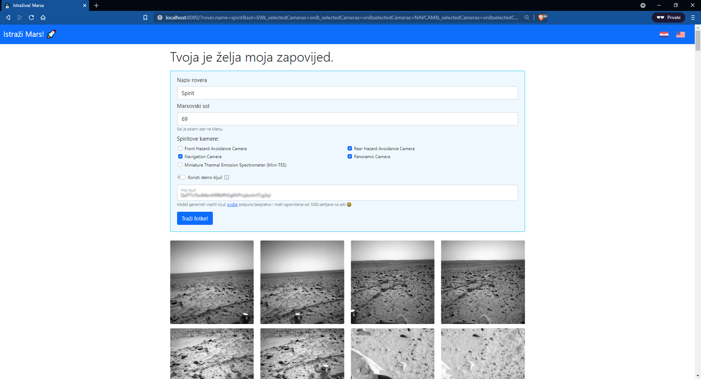

# Mars Rover Web Application :rocket:

### About

Mars Rover is a small web project that utilizes [NASA Mars Rover Photos API](https://api.nasa.gov/). The main idea behind it was to give more _'functionality'_ (convenience) to the said API, while also providing a nice UI so the experience of exploring Mars could be as simple as possible.

### Example UIs

#### Desktop

<table>
  <tr>
    <td></td>
    <td></td>
  </tr>
  <tr>
    <td></td>
    <td></td>
  </tr>
</table>

#### Tablet/Mobile

<table>
  <tr>
    <td></td>
    <td></td>
  </tr>
</table>

### Technologies required

* [Java 11 SDK](https://openjdk.java.net/projects/jdk/11/) (at minimum)
* [Docker 20](https://docs.docker.com/get-docker/) (should work with recent versions)

### Running the web application :hammer:

#### 1. Build Mars Rover service Docker Image:

```shell
$ ./gradlew bootBuildImage [--info]
```

#### 2. Run Docker Compose:

```shell
$ cd ./etc/docker && docker-compose up [-d]
```

Visit [http://localhost:8080/](http://localhost:8080/) and have fun!

### Bonus if you've read up to this point

Scientists planned to verify if Schrodinger's thought experiment prevails on Mars, but sadly Curiosity killed the cat, rendering the experiment futile.

So, an astronaut dreams of spending a little over a day on Mars... it is his Sol endeavour.
